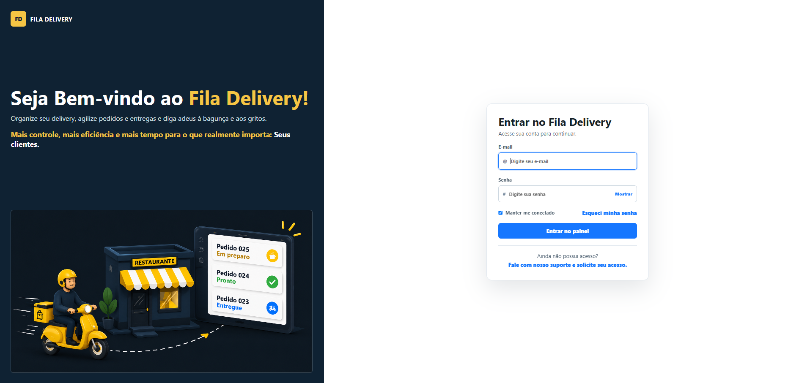
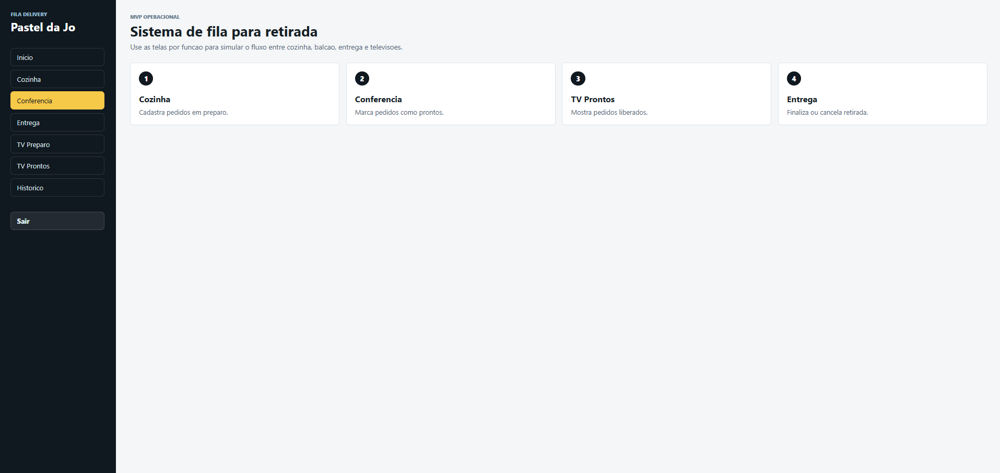
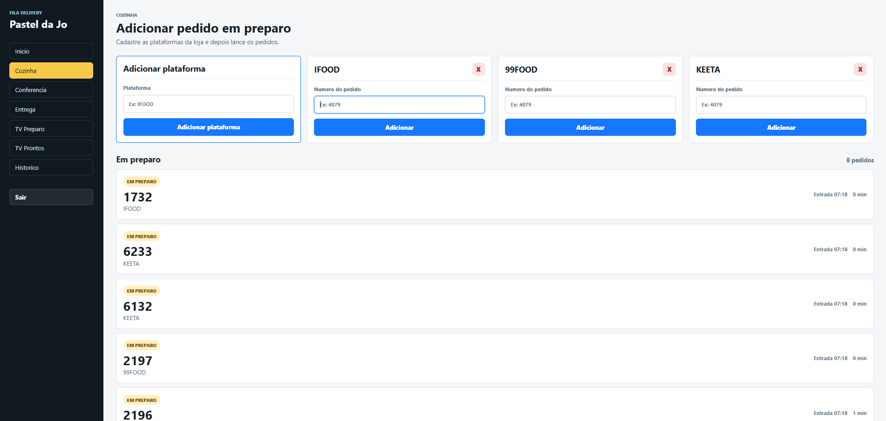
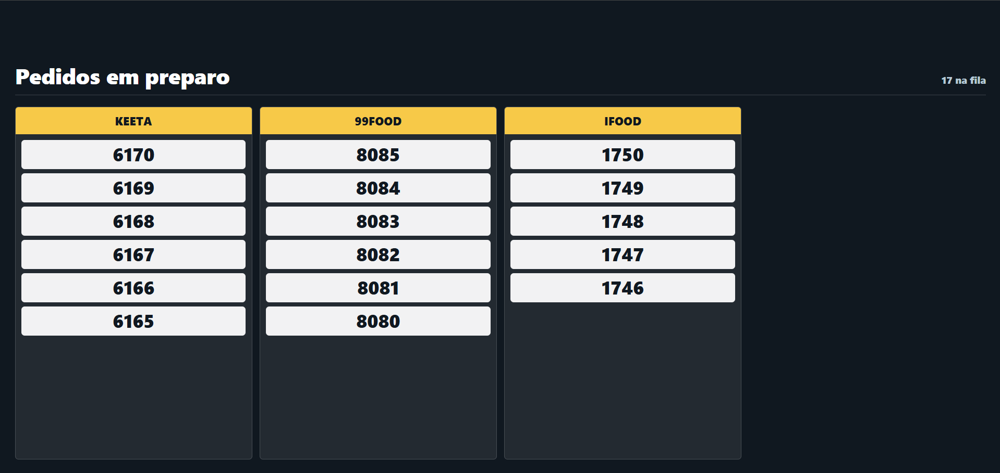
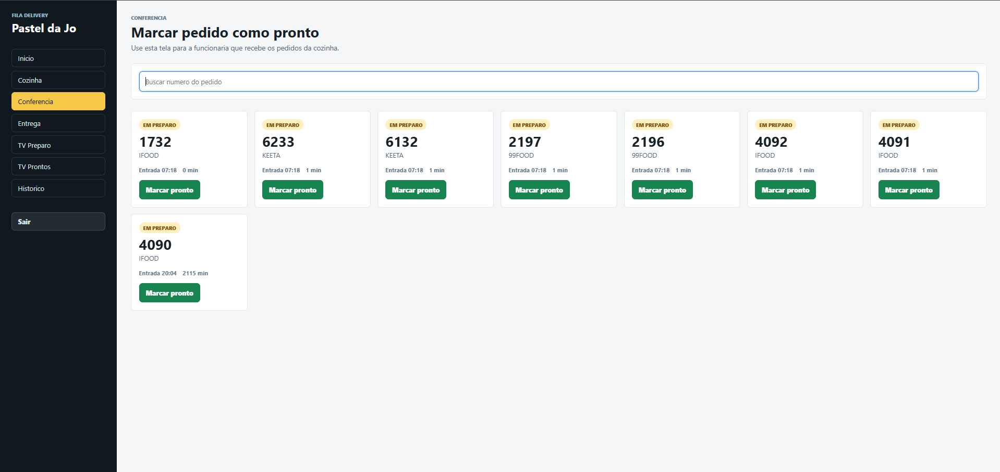
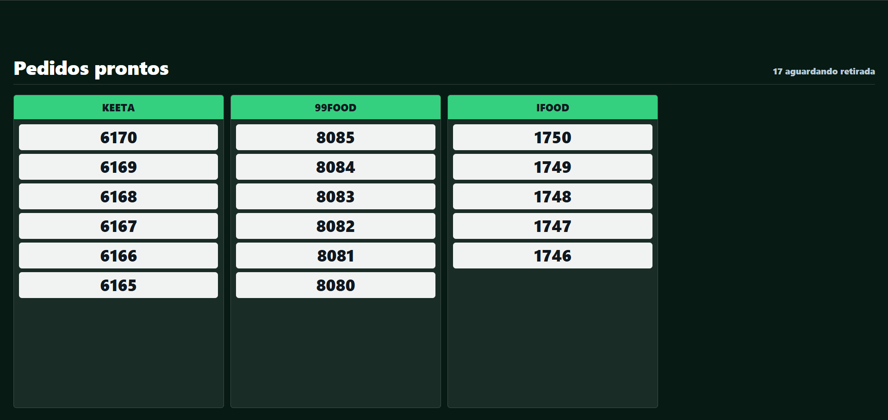
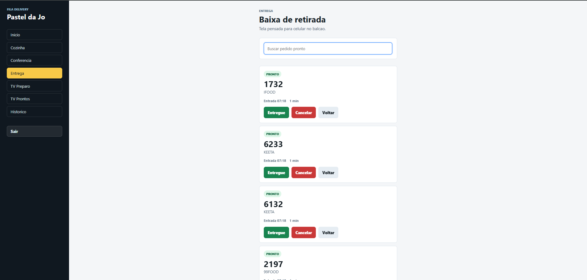
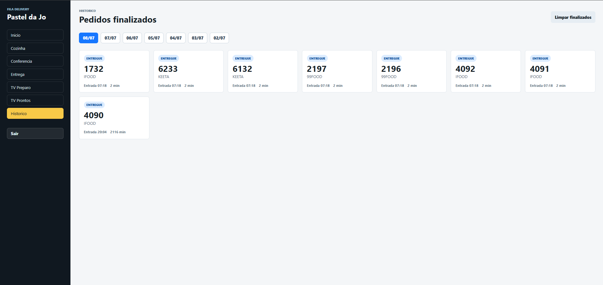

# Fila Delivery



## Sobre o projeto

O **Fila Delivery** é um SaaS web desenvolvido para restaurantes que trabalham com delivery e precisam organizar melhor o fluxo interno de pedidos.

A plataforma foi criada para reduzir falhas de comunicação entre cozinha, conferência e entrega, centralizando os pedidos em um único sistema.

O objetivo é substituir processos manuais, como anotações, chamadas de números e comunicação verbal, oferecendo uma operação mais organizada e eficiente.

## Funcionalidades

* ✅ Autenticação de usuários
* ✅ Sistema multi-restaurante (multi-tenant)
* ✅ Painel administrativo da plataforma
* ✅ Cadastro e gerenciamento de restaurantes
* ✅ Controle de pedidos
* ✅ Fluxo operacional de cozinha
* ✅ Tela operacional para TV
* ✅ Controle de entregas
* ✅ Histórico de pedidos
* ✅ Auditoria e logs estruturados
* ✅ Sistema de backup do banco
* ✅ Controle de permissões por perfil de usuário

---

## 📸 Screenshots

### Login


### Dashboard Restaurante



### Cozinha



### TV



### Conferencia



### TV



### Entrega



### Histórico



---

# Arquitetura

O projeto está dividido em duas aplicações principais:

```
fila-delivery/
│
├── apps/
│   ├── api/       # Backend
│   └── web/       # Frontend
│
├── docs/          # Documentação técnica
│
└── README.md
```

## Backend (`apps/api`)

API REST desenvolvida em Node.js utilizando:

* Node.js
* Express
* SQLite
* Migrations versionadas
* Seeds automáticos
* Autenticação
* Controle de sessões
* Auditoria
* Logs estruturados
* Rotinas de backup

## Frontend (`apps/web`)

Aplicação web desenvolvida com:

* React
* Vite
* JavaScript
* Componentização
* Layouts separados por perfil de acesso

---

# Tecnologias utilizadas

## Frontend

* React
* Vite
* JavaScript
* CSS

## Backend

* Node.js
* Express
* SQLite
* API REST

## Ferramentas

* Git
* GitHub
* Docker
* Postman

---

# Requisitos

Para executar o projeto localmente:

* Node.js 24+
* npm

---

# Configuração do ambiente

## 1. Clone o projeto

```bash
git clone https://github.com/seu-usuario/fila-delivery.git
```

Entre na pasta:

```bash
cd fila-delivery
```

---

## 2. Configure as variáveis de ambiente

Copie o arquivo de exemplo:

```bash
.env.example
```

para:

```bash
.env
```

Configure as variáveis necessárias:

* Chaves de autenticação
* Configurações do ambiente
* Dados iniciais do administrador

⚠️ Nunca envie arquivos `.env` com informações reais para o GitHub.

---

# Primeiro acesso administrativo

Na primeira inicialização, a API executa:

1. Criação das tabelas através das migrations.
2. Execução dos seeds necessários.
3. Criação do usuário administrador inicial.

As informações do administrador devem ser definidas através das variáveis de ambiente.

Exemplo:

```env
SEED_ADMIN_NAME=Administrador
SEED_ADMIN_EMAIL=admin@exemplo.com
SEED_ADMIN_PASSWORD=sua-senha-segura
```

---

# Executando o projeto

Instale as dependências:

```bash
npm install
```

Execute a API:

```bash
npm run dev:api
```

Execute o frontend:

```bash
npm run dev:web
```

Aplicação:

```
Frontend:
http://localhost:5173

API:
http://localhost:3333
```

---

# Scripts principais

## Backend

Iniciar API:

```bash
npm run start:api
```

Criar backup:

```bash
npm run backup:api
```

Executar testes:

```bash
npm run test:api
```

---

## Frontend

Build de produção:

```bash
npm run build:web
```

---

# Banco de dados

Atualmente o projeto utiliza SQLite como banco principal do MVP.

A estrutura do banco é criada através de migrations versionadas.

Fluxo:

1. API inicia.
2. Migrations são verificadas.
3. Estrutura do banco é atualizada.
4. Seeds necessários são executados.

Para ambientes maiores e produção com alto volume, a migração para PostgreSQL é recomendada.

---

# Backup e restauração

O sistema possui rotina de backup do banco.

O backup:

* Copia o arquivo do banco configurado.
* Calcula checksum SHA-256.
* Registra informações do processo.

Antes de restaurar:

1. Pare a aplicação.
2. Faça uma cópia do banco atual.
3. Restaure o arquivo desejado.
4. Reinicie a aplicação.
5. Valide o funcionamento.

---

# Docker

Para executar utilizando Docker:

1. Crie o arquivo `.env` baseado no `.env.example`.
2. Configure as variáveis obrigatórias.
3. Execute:

```bash
docker compose up --build
```

Os dados persistentes utilizam volumes Docker.

---

# Deploy

Para publicar o sistema em produção:

## Frontend

Pode ser hospedado utilizando plataformas como:

* Vercel
* Netlify

## Backend

Recomendado utilizar serviços como:

* Railway
* Render
* Fly.io

Checklist de produção:

* HTTPS ativo
* Variáveis de ambiente configuradas
* Segredos protegidos
* CORS configurado corretamente
* Banco persistente
* Rotina de backup configurada
* Monitoramento de logs

---

# Segurança

O projeto possui:

* Controle de acesso por perfil
* Isolamento de dados por restaurante
* Proteção de rotas administrativas
* Hash de informações sensíveis
* Controle de sessões
* Rate limit em autenticação
* Logs sem exposição de dados sensíveis

---

# Testes

A API possui testes automatizados para os principais fluxos do sistema.

Executar:

```bash
npm run test:api
```

Validar frontend:

```bash
npm run build:web
```

---

# Próximas evoluções

Possíveis melhorias futuras:

* Migração para PostgreSQL
* Aplicativo mobile para entregadores
* Integração com plataformas de delivery
* Dashboard com métricas avançadas
* Sistema de planos e assinaturas
* Gestão financeira

---

# Autor

Desenvolvido por **Vini Oliveira**

Projeto criado com foco em arquitetura SaaS, desenvolvimento Full Stack e soluções para operações de delivery.
