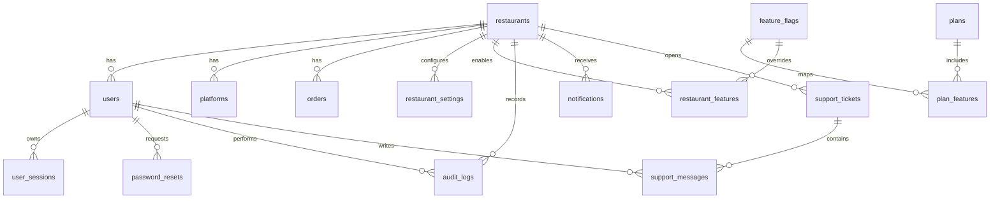

# Fila Delivery - Database Architecture

## Objetivo

Esta documentacao descreve a base de dados comercial do Fila Delivery usando SQLite hoje, mas mantendo nomes, tipos e relacionamentos simples para futura migracao para PostgreSQL.

## MER - Modelo Entidade Relacionamento

## DER - Estrutura Logica

### Entidades operacionais

- `restaurants`: tenants/clientes do SaaS.
- `users`: usuarios administrativos e usuarios vinculados a restaurantes.
- `platforms`: canais/plataformas usados por cada restaurante.
- `orders`: pedidos do fluxo cozinha, conferencia e entrega.

### Entidades comerciais

- `plans`: planos Trimestral, Semestral e Anual.
- `feature_flags`: catalogo de funcionalidades liberaveis.
- `plan_features`: lista de funcionalidades que ficam ativas para todos os planos.
- `restaurant_features`: overrides por restaurante.

### Entidades de seguranca

- `user_sessions`: sessoes, expiracao, logout, IP e browser.
- `password_resets`: tokens de recuperacao de senha.
- `audit_logs`: trilha de auditoria para eventos importantes.

### Entidades de configuracao, suporte e operacao

- `system_settings`: configuracoes globais.
- `restaurant_settings`: configuracoes por restaurante.
- `notifications`: avisos para usuarios/restaurantes.
- `backups`: registro de backups.
- `support_tickets`: chamados.
- `support_messages`: mensagens dos chamados.
- `system_events`: eventos tecnicos do sistema.

## Estrategia Multi-Tenant

Todo dado operacional de cliente deve possuir `restaurant_id`.

Regras:

- Usuario `CLIENT` sempre consulta dados filtrados por `restaurant_id`.
- Usuario `ADMIN` pode consultar dados globais.
- Indices compostos priorizam `restaurant_id`, `status` e `created_at`.
- Dados excluidos logicamente usam `deleted_at`.

## Soft Delete

Campos adicionados onde faz sentido:

- `deleted_at`
- `deleted_by`

Pedidos finalizados nao sao removidos fisicamente. A limpeza da tela marca `deleted_at`, preservando historico para auditoria e relatorios futuros.

## Fluxo de Migrations

1. `schema_migrations` registra migrations aplicadas.
2. Arquivos `.sql` em `database/migrations` rodam em ordem alfabetica.
3. Cada migration roda dentro de transacao.
4. Novas alteracoes devem ser sempre novas migrations.
5. Migrations antigas nao devem ser editadas depois de publicadas.

Migrations atuais:

- `001_initial_schema.sql`: schema MVP original.
- `002_operational_audit_columns.sql`: soft delete, `updated_at` e indices operacionais.
- `003_plans_and_feature_flags.sql`: planos e feature flags.
- `004_security_and_audit.sql`: auditoria, sessoes e recuperacao de senha.
- `005_settings_notifications_support.sql`: configuracoes, notificacoes, backups e suporte.

## Fluxo de Seeds

Seeds ficam separados de migrations.

- `adminSeed.js`: cria admin inicial em desenvolvimento ou quando senha de seed existe.
- `plansSeed.js`: cria Plano Trimestral, Plano Semestral e Plano Anual.
- `featureFlagsSeed.js`: cria catalogo inicial de features e vinculos por plano.
- `developmentSeed.js`: reservado para dados de demonstracao.

## Fluxo de Criacao de Restaurante

1. Admin SaaS envia dados do restaurante.
2. Service valida dados obrigatorios.
3. Transacao cria `restaurants`.
4. Transacao cria usuario `CLIENT` inicial.
5. Futuramente o evento deve gerar `audit_logs`.
6. Futuramente o restaurante deve receber `restaurant_settings` padrao e features do plano.

## Fluxo de Criacao de Usuario

1. Usuario pertence a um restaurante ou e admin global.
2. `email` e unico.
3. Usuario nao deve ser removido fisicamente.
4. Desativacao deve usar `active = 0` ou `deleted_at`.
5. Futuramente roles/permissoes granulares devem complementar `role`.

## Fluxo de Login

1. Usuario envia email e senha.
2. Backend busca usuario ativo e nao deletado.
3. Senha e validada.
4. Token e emitido.
5. `user_sessions` registra apenas o hash do token, IP, browser, expiracao e status da sessao.
6. `audit_logs` registra login com sucesso, falha de login, logout e eventos sensiveis.

## Fluxo de Auditoria

Eventos que devem gerar auditoria:

- login;
- logout;
- criacao/edicao/exclusao logica;
- mudanca de status de pedido;
- mudanca de plano;
- mudanca de senha;
- criacao de usuario;
- alteracao de restaurante;
- override de feature.

`audit_logs.before_data` e `audit_logs.after_data` armazenam JSON serializado como texto para manter compatibilidade SQLite/PostgreSQL.

## Preparacao PostgreSQL

Decisoes tomadas:

- IDs continuam como `TEXT`, compativeis com UUID.
- Datas em `TEXT` ISO para simplificar portabilidade inicial.
- JSON armazenado como texto por enquanto.
- Sem `AUTOINCREMENT`.
- Sem triggers obrigatorias.
- Sem recursos que prendam a regra de negocio ao SQLite.

Na migracao futura, datas poderao virar `TIMESTAMPTZ`, JSON podera virar `JSONB` e IDs poderao virar `UUID`.
